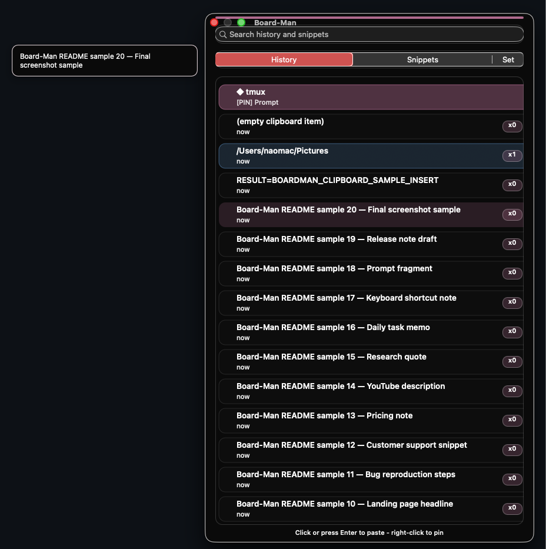

# Board-Man

[English](README.md) / [ja](docs/i18n/README.ja.md) / [zh-CN](docs/i18n/README.zh-CN.md) / [es](docs/i18n/README.es.md) / [pt-BR](docs/i18n/README.pt-BR.md) / [ko](docs/i18n/README.ko.md) / [de](docs/i18n/README.de.md) / [fr](docs/i18n/README.fr.md)

Board-Man is a macOS clipboard productivity utility derived from Clipy.

It extends the clipboard manager concept with workflow-oriented features such as paste activity visibility, menu bar feedback, and operator-friendly usage for people who repeatedly write, paste, edit, and move text across apps.

> Status: public candidate. This repository is a sanitized open-source edition prepared from an actively developed private build.

## Screenshot

## Download

- [Download Board-Man v1.2.3](https://github.com/uniplanck/boardman/releases/tag/v1.2.3)
- macOS app archive: `Board-Man-v1.2.3.zip`

> Note: Board-Man is an early public release. macOS may require opening it manually from System Settings if Gatekeeper blocks the first launch.

## Why Board-Man exists

Many clipboard managers help users store snippets, but they do not clearly show how often clipboard actions are used during real work.

Board-Man focuses on clipboard activity as an operational signal:

- writers can understand repetitive text workflows
- developers can track repeated paste-heavy operations
- marketers and operators can reduce manual copy/paste friction
- power users can connect clipboard actions with local automation tools

## Current direction

The public edition is planned to focus on:

- paste count tracking
- clipboard workflow visibility
- menu bar status feedback
- safe local-only operation
- clear build instructions for macOS
- documentation for contributors and fork maintainers

## Attribution

Board-Man is a heavily modified derivative work based on Clipy.

This repository preserves upstream attribution and license notices.

See:

- `ATTRIBUTION.md`
- `LICENSE`
- `LICENSE_CLIPMENU`

## Public release policy

This public repository should not contain:

- private logs
- personal absolute paths
- signing certificates
- provisioning profiles
- API keys or tokens
- local automation secrets
- production-only scripts
- private build artifacts
- user-specific configuration

## Planned v0.1 scope

- Buildable sanitized source tree
- Preserved upstream license and attribution
- Basic README
- Screenshot or short demo
- Minimal release notes
- Known limitations section

## License

Board-Man is distributed under the MIT license terms inherited from Clipy.

The original license and attribution notices are preserved in:

- `LICENSE`
- `LICENSE_CLIPMENU`
- `ATTRIBUTION.md`

Board-Man is a modified derivative work and is not endorsed by the upstream Clipy or ClipMenu maintainers.
