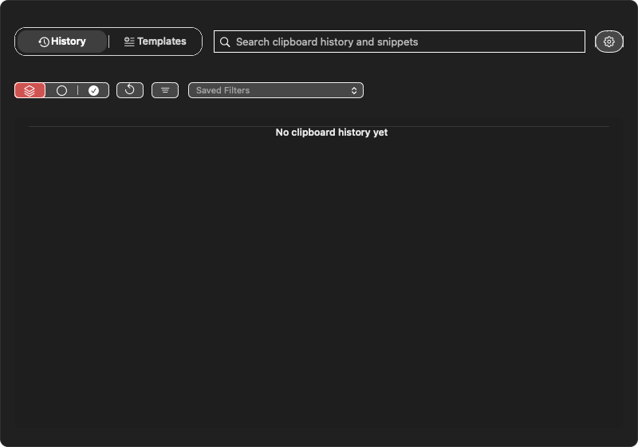
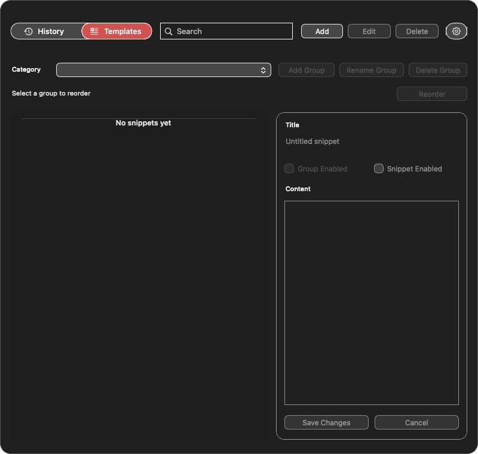
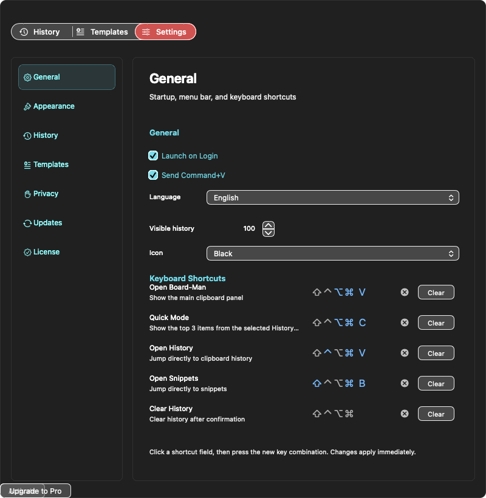
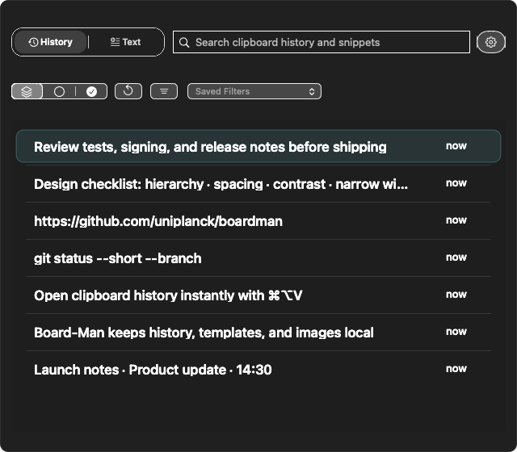

# Board-Man

**English** · [日本語](docs/i18n/README.ja.md) · [简体中文](docs/i18n/README.zh-CN.md) · [한국어](docs/i18n/README.ko.md) · [Español](docs/i18n/README.es.md) · [Français](docs/i18n/README.fr.md) · [Deutsch](docs/i18n/README.de.md) · [Português](docs/i18n/README.pt-BR.md)

Board-Man is a local-first macOS clipboard workspace for fast recall, repeated text, pins, search, images, usage signals, and keyboard-driven pasting.

> The current formal product line is **v0.1.0**. It follows the intentional version reset from the older v1.2.3 experimental line; `main` can still contain changes that have not yet shipped in a tagged archive.



## What Board-Man does

Board-Man keeps the clipboard workflow in one compact panel instead of making you bounce between a clipboard menu, a template manager, and a settings window.

- Open clipboard history with `⌘⌥V`
- Search text, URLs, commands, and image entries
- Paste the selected item with Return or a single click
- Pin important entries permanently or for a timed period
- Store repeated text as reusable **Templates**
- Group, reorder, enable, disable, and edit Templates
- See local usage signals and style used items separately from pinned items
- Mask sensitive rows without deleting their local data
- Adjust timestamp format, timestamp position, and timestamp actions
- Show or hide image entries and place image previews on the left or right
- Tune item text size, panel height, theme, font, and display density
- Keep clipboard data local without requiring cloud synchronization

## Interface tour

### History


History is the main clipboard timeline. Mouse hover and keyboard navigation share the same active selection, so moving with `↑` / `↓` continues from the row currently under the pointer and moving the pointer updates the active row again.

Rows can show pins, timestamps, usage indicators, masks, and image previews without allowing those accessories to squeeze the central title into an unreadable layout. Pin labels can be displayed as `OFF`, `P`, or `PIN`.

### Templates



Templates are reusable text entries for replies, prompts, commands, URLs, checklists, and other content you paste repeatedly.

- **Single-click** a Template to paste it
- **Double-click** a Template to open it for editing
- Use `↑` / `↓` or the pointer to move through the same selection state
- Create and rename groups
- Enable or disable a group or individual Template
- Reorder Templates without rebuilding the group
- Edit title and content in the right-side editor

The source code still uses the historical internal term `snippet`; the product UI uses **Templates** in English and **定型文** in Japanese.

### Settings and live appearance controls



The Appearance screen uses card-based controls with a live preview. The current development UI includes controls for:

- **Layout**: row numbers, UI density, item text size, panel height
- **Timestamp**: relative/absolute presentation, position, and interaction behavior
- **Usage**: usage counts, used-item appearance, Pin label style, image visibility and position
- **Theme & color**: theme preset, light/dark mode, font, and lighten option

Additional settings cover History, Templates, shortcuts, privacy, updates, licensing, excluded applications, and other panel behavior.

### Compact width



At narrower widths, the center title absorbs compression while Pin, timestamp, and other fixed accessories retain usable spacing. Tab labels switch to shorter localized forms instead of collapsing into ellipses.

### Japanese UI captures

The screenshot workflow also keeps matching Japanese scenes current:

- [History](docs/assets/screenshots/board-man-history-ja.png)
- [Templates](docs/assets/screenshots/board-man-templates-ja.png)
- [Settings](docs/assets/screenshots/board-man-settings-ja.png)
- [Compact History](docs/assets/screenshots/board-man-history-compact-ja.png)

## Core interactions

| Action | Default interaction |
|---|---|
| Open Board-Man | `⌘⌥V` |
| History / Templates / Settings | `⌘1` / `⌘2` / `⌘3` |
| Focus search | `⌘F` |
| Move active row | `↑` / `↓` |
| Paste selected row | `Return` |
| Paste a Template | Single click |
| Edit a Template | Double click |
| Copy selected row | `⌘C` |
| Pin or unpin | `⌘P` |
| Preview | `Space` |

Timestamp actions and several other shortcuts are configurable in Settings rather than being fixed to one global default.

## Local-first behavior

Clipboard history can contain passwords, tokens, customer information, private URLs, local paths, and images. Board-Man therefore keeps its working data on the Mac and does not require a cloud clipboard account.

Privacy-related behavior includes masking rows, history controls, excluded applications, and local retention settings. Review those settings before using Board-Man with especially sensitive workflows.

## Paste reliability

Board-Man uses macOS Accessibility and Input Monitoring permissions for global shortcuts and reliable direct pasting. Recent development work also includes Chromium paste reliability improvements, image clipboard identity handling, and recovery paths for older clipboard / Template records whose original payload needs reconstruction.

macOS permission prompts are never bypassed. Accessibility and Input Monitoring must be granted by the user in System Settings.

## Download

Download [Board-Man v0.1.0](https://github.com/uniplanck/boardman/releases/tag/v0.1.0), unzip `Board-Man-v0.1.0.zip`, and move `Board-Man.app` to `/Applications`.

If macOS blocks the first launch, Control-click the app and choose **Open**, or allow it from **System Settings → Privacy & Security**.

## Requirements

- macOS 13 or later
- Apple Silicon or Intel Mac
- Accessibility permission for global interaction and direct paste behavior
- Input Monitoring permission for reliable shortcut handling

## Build from source

```bash
git clone https://github.com/uniplanck/boardman.git
cd boardman
xcodebuild \
  -project Board-Man.xcodeproj \
  -scheme Board-Man \
  -configuration Debug \
  -destination 'platform=macOS' \
  -skipPackagePluginValidation \
  -skipMacroValidation \
  build
```

Run the test suite with:

```bash
xcodebuild \
  -project Board-Man.xcodeproj \
  -scheme Board-Man \
  -configuration Debug \
  -destination 'platform=macOS' \
  -parallel-testing-enabled NO \
  -maximum-parallel-testing-workers 1 \
  test
```

Maintainers installing a local development build should use [`scripts/boardman/install-dev-stable.sh`](scripts/boardman/install-dev-stable.sh) and read [`docs/boardman-dev-install.md`](docs/boardman-dev-install.md). The helper keeps the canonical local app at `/Applications/Board-Man.app`, uses a stable signing identity, verifies the result, and avoids accumulating indexed development copies.

## Refresh README screenshots

README captures are generated from isolated temporary Board-Man profiles with deterministic demo clipboard content. They do **not** use the maintainer's real clipboard history or Templates database.

The automatic screenshot exporter is intentionally available in **Debug builds**. Build a current Debug app first, then pass that app to the capture script:

```bash
BOARDMAN_SCREENSHOT_APP=/path/to/Debug/Board-Man.app \
  ./scripts/boardman/capture-readme-screenshots.sh
```

The script generates English and Japanese History, Templates, Settings, and compact-width scenes under `docs/assets/screenshots/`, verifies the PNG dimensions, cleans up its temporary profiles, and restores the canonical app when needed.

See [`docs/readme-screenshots.md`](docs/readme-screenshots.md) for the full workflow and verification checklist.

## Development status

v0.1.0 is the first formal product-line release after the 0.0.1 internal baseline and the older v1.2.3 experimental line. It brings together the rebuilt History / Templates / Settings panel, expanded Appearance controls, timed pins, usage styling, image controls, modern Template management, selection and responsive-layout polish, local licensing foundations, and update infrastructure.

For the authoritative development summary, see [`CHANGELOG.md`](CHANGELOG.md).

## Documentation

- [Changelog](CHANGELOG.md)
- [v0.1.0 release notes](docs/boardman-v0.1.0-release-notes.md)
- [Development install guide](docs/boardman-dev-install.md)
- [QA checklist](docs/BOARDMAN_QA_CHECKLIST.md)
- [Screenshot workflow](docs/readme-screenshots.md)
- [Release and update architecture](docs/boardman-release-update-spec.md)
- [UI design system](docs/boardman-ui-design-system.md)
- [Contributing guide](.github/CONTRIBUTING.md)
- [Security policy](.github/SECURITY.md)
- [Support guide](.github/SUPPORT.md)

## License and attribution

Board-Man is a heavily modified derivative of [Clipy](https://github.com/Clipy/Clipy) and preserves upstream attribution and license notices:

- [`ATTRIBUTION.md`](ATTRIBUTION.md)
- [`LICENSE`](LICENSE)
- [`LICENSE_CLIPMENU`](LICENSE_CLIPMENU)

Board-Man is distributed under the inherited MIT license terms and is not endorsed by the upstream Clipy or ClipMenu maintainers.
