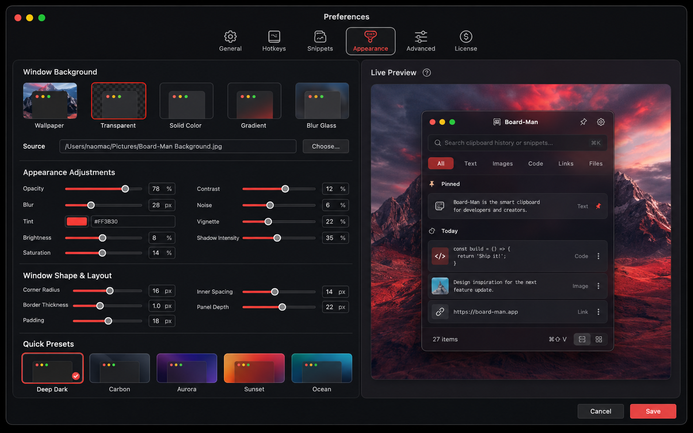
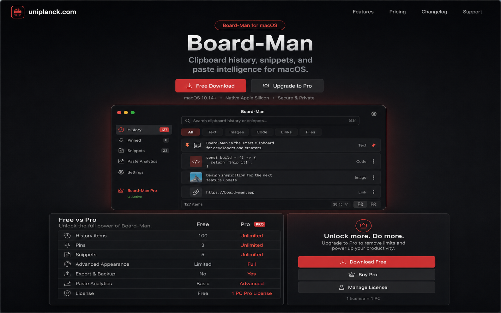
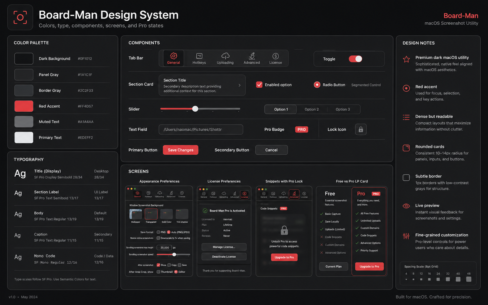
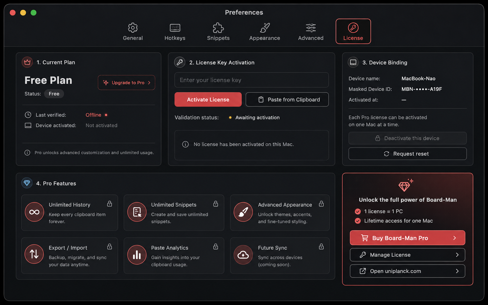
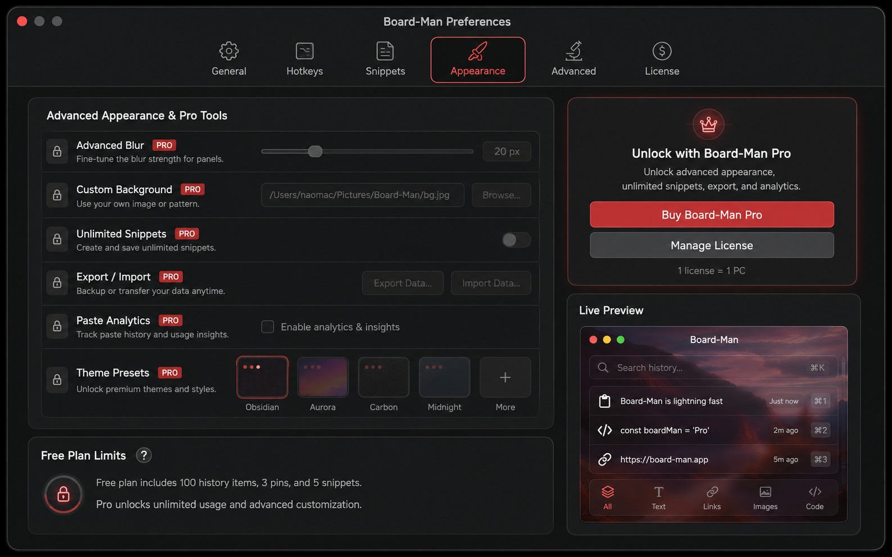

# Board-Man UI Design System

## Design Direction

Board-Man should feel like a premium dark macOS utility: dense, direct, and professional. Preferences should follow a Shottr-like layout with compact panels, precise controls, red accent color, charcoal surfaces, and fine-grained customization.

Reference assets:

- 
- 
- 
- 
- 

## Color Tokens

| Token | Value | Usage |
| --- | --- | --- |
| `color.bg.app` | `#151515` | Preferences window background |
| `color.bg.panel` | `#1E1E1E` | Section panels |
| `color.bg.panelAlt` | `#252525` | Nested control rows |
| `color.border.subtle` | `#343434` | Hairline dividers |
| `color.text.primary` | `#F2F2F2` | Primary labels |
| `color.text.secondary` | `#B8B8B8` | Descriptions |
| `color.text.muted` | `#7D7D7D` | Disabled text |
| `color.accent.red` | `#FF3B30` | Primary accent, Pro calls to action |
| `color.accent.redHover` | `#FF5148` | Hover accent |
| `color.status.warning` | `#FFB020` | Trial or grace warnings |
| `color.status.success` | `#35C759` | Active license |

## Typography Tokens

| Token | Size | Weight | Usage |
| --- | --- | --- | --- |
| `type.windowTitle` | 18 | 600 | Preferences title |
| `type.sectionTitle` | 13 | 600 | Section headers |
| `type.label` | 12 | 500 | Control labels |
| `type.body` | 12 | 400 | Descriptions |
| `type.caption` | 11 | 400 | Metadata and helper text |
| `type.badge` | 10 | 700 | Pro badge |

Use San Francisco through native SwiftUI/AppKit fonts. Do not use oversized marketing typography inside Preferences.

## Spacing Tokens

| Token | Value |
| --- | --- |
| `space.2` | 2 |
| `space.4` | 4 |
| `space.6` | 6 |
| `space.8` | 8 |
| `space.12` | 12 |
| `space.16` | 16 |
| `space.20` | 20 |
| `space.24` | 24 |

Preferences should be compact. Control rows should usually be 28 to 36 px tall.

## Radius Tokens

| Token | Value | Usage |
| --- | --- | --- |
| `radius.control` | 6 | Buttons, text fields, toggles |
| `radius.panel` | 8 | Preference sections |
| `radius.badge` | 999 | Pro pills only |

## Card And Section Rules

- Use panels for grouped settings, not decorative cards.
- Keep section radius at 8 px or less.
- Use subtle borders and dividers instead of heavy shadows.
- Avoid nested card styling.
- Keep labels left aligned and controls right aligned where possible.

## Tab Bar Rules

- Top-level Preferences tabs: General, Hotkeys, Snippets, Appearance, Advanced, License.
- Use icon plus text where native macOS toolbar tabs are available.
- Active tab uses red accent or strong foreground, not a large filled pill.
- Tab content must not shift layout when switching between common states.

## Form Controls

- Slider: compact horizontal control with numeric value where precision matters.
- Toggle: native switch for binary settings.
- Checkbox: multiple independent options in dense groups.
- Radio: mutually exclusive choices in a short list.
- Segmented control: mode selection such as Light, Dark, System or Small, Medium, Large.
- Text field: license key, search, custom values; use monospace only for keys or code-like values.
- Button: red for primary Pro or activation action, neutral charcoal for secondary actions.
- Pro badge: small red badge next to locked feature label.
- Lock icon: place near disabled controls and keep disabled reason visible.

## Preferences Structure

- General: launch, menu behavior, history basics.
- Hotkeys: global shortcuts and paste behavior.
- Snippets: snippet management, folders, expansion options.
- Appearance: theme, menu density, row style, badge visibility, accent options.
- Advanced: storage, privacy, diagnostics, import/export.
- License: Free/Pro state, activation, trial, device binding, deactivation.

## Appearance Tab Structure

Recommended sections:

- Theme: System, Dark, Light, high contrast.
- Menu style: row height, width, opacity, blur, divider visibility.
- Clipboard item display: previews, icons, paste count badge, timestamps.
- Accent: red default, controlled accent variations if Pro.
- Pro customization: advanced spacing, custom colors, badge style, saved presets.

## License Tab Structure

Recommended sections:

- Current plan summary: Free, Trial, Pro Active, Expired, Invalid, or Offline Grace.
- Upgrade panel: concise Free vs Pro value and uniplanck.com purchase link.
- Activation: license key field, activate button, validation status.
- Device: current device name or masked id, one license equals one PC note.
- Maintenance: deactivate, reset instructions, last verified date.

## Pro Lock UI Pattern

Locked Pro controls should be visible but disabled. The user should understand what exists without accidentally changing settings.

Rules:

- Keep locked controls in the same layout position.
- Add a small Pro badge and lock icon.
- Disable the control visually and functionally.
- Explain the unlock requirement in one short helper line or tooltip.
- Execution paths must also check entitlement; UI lock alone is not enough.

## uniplanck.com Landing Page Connection

The uniplanck.com landing page should share the same product language and visual system:

- Dark charcoal background.
- Red accent for Pro upgrade and download actions.
- Dense screenshots of real Preferences and locked states.
- Free vs Pro matrix consistent with in-app entitlement names.
- Download path remains clear for Free users.

## SwiftUI And AppKit Implementation Notes

- Prefer native macOS controls where they match the visual target.
- Wrap entitlement-aware controls in a reusable view modifier or helper.
- Keep tokens centralized in a small style namespace.
- Use SF Symbols for lock, check, warning, and license state icons.
- Avoid hardcoded Pro checks in individual views.
- Keep Preferences layout stable across Free, Trial, Pro, Expired, and Invalid states.
