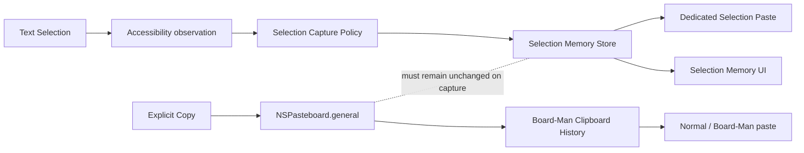

# Board-Man Selection Memory — Product / UX / Architecture Design Plan

Status: **DESIGN / NOT IMPLEMENTED**

Created: **2026-09-01**

Scope: Board-Man local macOS paid feature planning

Commercial model: **Free + one-time Lifetime**

Repository snapshot reviewed: `refactor/boardman-independent-core-20260821` @ `acc6688`

---

## 0. Executive decision

Board-Man should not ship this as a generic “Auto Copy” toggle.

The stronger product is a new local information layer named **Selection Memory**:

> **Text the user selects becomes recoverable without changing the normal macOS clipboard.**

The operating model is intentionally dual-lane:

1. **Clipboard History** records explicit copy intent (`⌘C`, app copy commands, etc.).
2. **Selection Memory** records selected text as an independent, local, short-lived “pre-clipboard”.

Normal `⌘V` must continue to paste the user’s real system clipboard. A separate configurable Board-Man shortcut pastes the latest Selection Memory item or opens its history.

The best extension is **Harvest Mode / Selection Stack**:

> Enter a bounded collection session, select fragments across apps/pages, then paste them sequentially or join them into one output.

This turns a passive auto-copy feature into an intentional cross-application collection workflow and gives Board-Man a clearer product identity than “another clipboard history app”.

### Recommendation

- **Product/UI name:** `Selection Memory`
- **Japanese candidate:** `選択メモリ` or `選択履歴`
- **Internal concepts:** `SelectionCaptureService`, `SelectionMemoryStore`, `SelectionPasteService`
- **Marketing concept:** “Copy without copying.” / 「コピーしなくても、選んだものはあとで使える。」
- **Commercial class:** `Lifetime local`
- **Persistence:** separate Board-Man store, **not** `NSPasteboard.general` and **not** normal clipboard-history rows
- **MVP:** text only, local only, privacy-first, configurable retention, separate paste shortcut
- **Killer follow-up:** Selection Stack / Harvest Mode

---

## 1. Why this feature is worth building

### 1.1 The generic clipboard-history category is becoming commoditized

As of 2026-09-01, macOS Tahoe itself exposes clipboard history through Spotlight. Apple documents `Command + 4` for opening the Clipboard browse mode and searching/reusing previously copied content.

Board-Man therefore should not rely on “we remember copied items” as the premium differentiation. The OS can increasingly satisfy that baseline.

Existing competitors also cover the conventional clipboard space deeply:

- Raycast stores copied text, images, files, links, emails, colors and original formats.
- Alfred provides searchable clipboard history, custom hotkeys, merge, snippets and ignored-app privacy controls.
- Dedicated clipboard products provide timelines, pinning, grouping and multi-item workflows.

The underserved layer is the step **before copy**:

```text
user notices something
    ↓
user selects it
    ↓
maybe they copy it, maybe they do not
```

A normal clipboard manager only sees the final explicit copy. Selection Memory can preserve the useful candidate the user noticed but never copied.

### 1.2 Selection is a different signal from copy

A copy event usually means:

> “I definitely want this in the clipboard now.”

A selection event more often means:

> “This is relevant right now.”

That difference matters. Selection Memory is not just a second history list. It is an **attention buffer** between reading and copying.

Examples:

- You highlight a sentence in ChatGPT, switch tabs, then realize you needed it.
- You select a product name, price and feature from three different pages.
- You select an error, then overwrite the system clipboard with a command.
- You highlight several fragments while researching and want them together later.

Today these moments disappear unless the user remembers to press `⌘C` each time.

---

## 2. Product model: two independent lanes



### Lane A — Clipboard History

Existing Board-Man behavior remains authoritative:

- follows `NSPasteboard.general`,
- records explicit clipboard changes,
- normal `⌘V` uses the system clipboard,
- existing history, pins, search and paste logic continue to work.

### Lane B — Selection Memory

New behavior:

- observes meaningful selected text,
- stores it in a dedicated local store,
- does **not** write to `NSPasteboard.general` during capture,
- does **not** make normal `⌘V` paste the selected text,
- has its own paste shortcut and UI,
- has its own retention and privacy policy.

### Hard invariant

**Selecting text must never change the system clipboard.**

If an application does not expose selected text through an accessibility-safe path, Board-Man should fail closed for that application rather than synthesize `⌘C` as a hidden fallback.

---

## 3. Better version of the original idea

The naive implementation would save every selection change. That is wrong.

During a drag, macOS/app accessibility state can evolve like this:

```text
こ
こん
こんに
こんにち
こんにちは
```

Persisting every intermediate value creates noise, unnecessary writes and privacy exposure.

Selection Memory should instead model **settled intent**.

### 3.1 Capture pipeline

```text
selection changed
    ↓
read candidate text
    ↓
coalesce changes from same focused element
    ↓
short debounce window
    ↓
privacy / entitlement / exclusion checks
    ↓
normalize + deduplicate
    ↓
persist one settled item
```

Initial target for the prototype: approximately **180–250 ms** after the latest selection change before capture. This is a target to benchmark, not a fixed production constant.

### 3.2 Capture only meaningful selections

Reject by default:

- empty values,
- whitespace-only selections,
- secure/password fields,
- excluded applications,
- Board-Man’s own transient paste operation,
- unchanged duplicate selection within a short coalescing window.

Optional policy later:

- minimum character count,
- maximum item size,
- ignore single-character selections,
- per-app minimum lengths,
- selected-text pattern exclusions.

### 3.3 Ephemeral by default

A selection stream is much noisier and more privacy-sensitive than an explicit clipboard stream.

Recommended default:

- Selection Memory **expires automatically after 24 hours**.
- Pinned/promoted selections can persist.
- Lifetime settings may offer retention presets such as `1 hour / 24 hours / 7 days / 30 days / Forever`.

This is a privacy/storage policy, not a Free/Lifetime quota.

“Capture everything forever” should **not** be the default.

---

## 4. Commercial / Lifetime design

The authoritative Board-Man commercial contract is currently Free + one-time Lifetime with no subscription. `docs/boardman-commercial-lifetime-roadmap.md` explicitly grants Lifetime access to future local paid features.

Selection Memory fits that definition exactly.

### Recommended entitlement

Add a future local feature identifier such as:

```swift
case selectionMemory
```

with access model:

```text
lifetimeLocal
```

Properties:

- Free cannot execute Selection Memory capture/paste mutations.
- Lifetime can use it locally and offline.
- Existing valid Lifetime licenses automatically unlock it under the current future-local-feature semantics.
- No new token reissuance should be required merely because the feature identifier was added later.
- AI/cloud behavior is **not** implied by this entitlement.

### Free UX recommendation

Do **not** add a “10 selections per day” or similar arbitrary quota for the first release.

That would create:

- another counter,
- another retention edge case,
- more entitlement tests,
- a confusing distinction between normal Free history limits and Selection Memory limits,
- additional handling of sensitive text even for users who are not entitled to retain it.

Better:

- Show the Selection Memory surface/settings clearly in Free.
- Explain the feature and privacy model.
- Keep it locked.
- Enforce the same lock in the execution layer.
- Lifetime unlocks the complete local feature.

This keeps the commercial story simple: Free remains a real clipboard manager; Lifetime adds the new pre-clipboard workflow.

---

## 5. Proposed user experience

### 5.1 First-run / enable flow

Selection Memory should be **off until explicitly enabled**, even for Lifetime.

Reason: this feature observes user selections, which is materially more sensitive than ordinary copied content.

Enable flow:

1. User opens `Selection Memory` settings.
2. Board-Man explains exactly what will be captured.
3. Existing Accessibility permission is checked.
4. User enables Selection Memory.
5. Secure fields and excluded apps remain blocked regardless of the toggle.
6. A visible pause/resume control becomes available.

Do not silently enable it after purchase or update.

### 5.2 Main panel

Recommended first-class surface:

```text
History | Selection | Templates
```

Why a real Selection surface instead of hiding it inside History:

- it communicates that system Clipboard and Selection Memory are different,
- it makes the Lifetime value visible,
- it avoids accidentally mixing explicit and implicit history,
- it enables different retention/privacy affordances.

Each row should initially show:

- selected text preview,
- source app icon/name,
- relative timestamp,
- optional pin/promote state,
- optional source metadata if safely available.

Core actions:

- Return / click → paste selected Selection Memory item,
- Delete → delete only that selection,
- search,
- clear Selection Memory,
- promote to normal History/Pin/Template,
- optional `Copy to System Clipboard` explicit action.

### 5.3 Dedicated shortcut vocabulary

Keep shortcuts configurable through the existing Board-Man shortcut recorder.

Candidate actions:

1. `Paste Latest Selection`
2. `Open Selection Memory`
3. later: `Toggle Harvest Mode`
4. later: `Paste Next Selection Stack Item`

Do not hard-code final default combinations until conflict testing is complete.

A candidate for `Paste Latest Selection` is `⌃⌥V`, but it should remain a design candidate until system/app conflicts are tested.

### 5.4 Pause controls

Selection Memory needs faster privacy control than opening Settings.

Recommended menu:

```text
Selection Memory: On
Pause for 15 minutes
Pause for 1 hour
Pause until resumed
Clear Selection Memory…
```

A subtle menu-bar/settings status should make it possible to determine whether capture is active.

---

## 6. The strongest extension: Harvest Mode / Selection Stack

This is the highest-priority follow-up and may ultimately become the feature users remember Board-Man for.

### Problem

Research and repetitive work often require collecting several fragments:

```text
Page A → product name
Page B → price
ChatGPT → explanation
Docs → command
```

Traditional workflow:

```text
select → ⌘C → switch → paste
select → ⌘C → switch → paste
select → ⌘C → switch → paste
```

### Harvest Mode

User starts an explicit collection session:

```text
Toggle Harvest Mode
    ↓
select fragment A
select fragment B
select fragment C
    ↓
Board-Man Selection Stack = [A, B, C]
```

Then choose:

- **Paste Next**: A → B → C sequentially,
- **Paste All**: join A/B/C,
- **Join with newline**,
- **Join with bullets**,
- **Join with tabs / CSV columns**,
- **Save as Template**,
- **Save as named Selection Set / Board**.

### Why this is stronger than passive capture

Passive Selection Memory solves forgotten selections.

Harvest Mode solves an explicit workflow that is currently tedious. It also reduces the privacy/noise problem because the user deliberately enters a collection state.

The ideal product supports both:

- **Smart Memory:** passive, ephemeral recovery buffer.
- **Harvest Mode:** explicit, bounded multi-selection collection session.

---

## 7. Horizontal / novel feature ideas

The following ideas are deliberately broader than MVP. They are ranked later in this document.

### 7.1 Attention Time Machine

Position Selection Memory as recovery of **what you noticed**, not only what you copied.

A command opens the last 5/15/60 minutes of selections grouped by app/time.

Useful when the user remembers “I highlighted that sentence a minute ago” but not where it was.

### 7.2 Selection Join

Select multiple fragments across unrelated apps, then emit them as:

- newline list,
- bullets,
- numbered list,
- comma-separated values,
- tab-separated values,
- space-joined text,
- configurable separator.

No AI or network required.

### 7.3 Source-Aware Paste

Where safe source metadata is available, paste formats can include provenance:

```text
Selected text
Source: Page title — URL
```

or Markdown:

```markdown
> Selected text

[Source](https://example.com)
```

Potential presets:

- plain text,
- quote + source,
- Markdown quote,
- Markdown link,
- research note,
- code comment with source.

This is especially valuable for research, writing and marketing workflows.

### 7.4 Return to Source

If Board-Man has a reliable URL or reopenable app/document reference, a Selection row can offer `Open Source`.

Important limitation: exact re-selection/highlighting of an arbitrary old range across all macOS apps is not a reliable generic promise. Reopen the source when possible; do not claim precise range restoration without app-specific evidence.

### 7.5 Selection → Template

Promote a useful selection into Board-Man Templates in one action.

Follow-up enhancement:

- detect obvious variable segments locally,
- let the user convert them into existing Template variables.

This connects discovery with repeated future use.

### 7.6 Selection Compare

Select text A, then text B, invoke `Compare Selections`.

Board-Man opens a local diff view showing:

- additions,
- removals,
- line/word differences.

Strong use cases:

- copy changes,
- prompt versions,
- contract text,
- code/error comparison,
- product-page changes.

### 7.7 Search Board-Man for Selected Text

A shortcut uses the current selected text as a query against:

- normal History,
- Selection Memory,
- Templates.

This does not need to persist the current selection first.

It turns highlighted text into a universal Board-Man search input.

### 7.8 Selection Recipes

Deterministic, local actions based on detected content type:

- URL → open / Markdown link / domain only,
- email → copy address / mail action,
- JSON → compact / pretty-print,
- hex color → normalize,
- date → format variants,
- path → shell-escape / reveal,
- code → wrap in code fence,
- text → trim / case conversion / quote.

Unlike generic pop-up actions, Board-Man can retain the original in Selection Memory so the transformation is reversible.

### 7.9 Selection Paste Ring

Repeatedly press one shortcut to cycle backwards through recent selections without opening the panel.

Example conceptual behavior:

```text
press 1 → latest
press 2 → previous
press 3 → third previous
```

Needs careful undo/replace semantics; not MVP.

### 7.10 Selection Slots

Promote a few fragments to temporary numbered slots `1…9` and paste a slot by shortcut.

Useful, but shortcut complexity is high. Keep later than Selection Stack.

### 7.11 Selection Sets / Boards

Create a named temporary collection:

```text
Board: Kimi PR research
Board: Competitor pricing
Board: Error investigation
```

Selections during that session are grouped automatically.

This gives “Board-Man” a literal board concept and connects naturally to the existing `workspaceSessions` paid capability.

### 7.12 Local Context Gate for AI agents

A future local integration could expose only a user-approved Selection Board to an agent instead of exposing the entire clipboard history.

This is more privacy-preserving than “AI can read all clipboard history”.

However:

- MCP/API policy is a separate product/security decision,
- existing `apiAccess` is currently service-backed in the commercial model,
- competitor products already expose clipboard history to AI tooling.

Therefore this is **not** a core differentiator or MVP item.

### 7.13 Local productivity metrics

Possible local-only metrics:

- selections recovered,
- selections promoted to Templates,
- Selection Stack sessions completed,
- dedicated pastes performed.

Avoid unverified claims such as “saved 3.7 hours” unless Board-Man has a defensible measurement model.

---

## 8. Architecture aligned with the current Board-Man codebase

The following was derived from the actual repository state reviewed on 2026-09-01.

### Existing components to reuse

| Existing component | Current role | Selection Memory reuse |
|---|---|---|
| `ClipService` | polls `NSPasteboard.general`, filters excluded apps, persists clipboard history | reuse queue/privacy patterns, **not** the pasteboard capture path |
| `PasteService` | stages content on general pasteboard and emits paste shortcut | reuse event/paste reliability knowledge; add safe transient transaction |
| `HotKeyService` | configurable global Board-Man shortcuts | add Selection actions |
| `AccessibilityService` | permission checks and Accessibility UX | reuse permission boundary |
| `ExcludeAppService` | excludes sensitive/unwanted applications | apply before every Selection capture |
| `EntitlementService` / `EntitlementGate` | Free/Lifetime feature and limit authority | add Lifetime-local Selection feature |
| `BoardManStore` | clipboard/Templates storage abstraction | preserve separation; do not disguise Selection rows as normal clips |
| current search/panel infrastructure | query/navigation/paste UI | reuse presentation patterns where practical |

### Proposed components

```text
SelectionCaptureService
    ├─ observes focused element / selection changes
    ├─ reads selected text through Accessibility
    └─ emits candidate events

SelectionCapturePolicy
    ├─ entitlement
    ├─ enabled / paused state
    ├─ excluded apps
    ├─ secure field rejection
    ├─ coalescing / debounce
    ├─ dedupe / bounds
    └─ retention policy

SelectionMemoryStore
    ├─ independent records
    ├─ search
    ├─ expiry
    ├─ pin/promote state
    └─ source metadata

SelectionMemoryCoordinator
    ├─ panel/UI projection
    ├─ search
    ├─ delete/clear
    └─ promotion to History / Template / Board

SelectionPasteService
    ├─ paste latest / selected row
    ├─ transient pasteboard transaction
    └─ later stack/sequential paste
```

---

## 9. Capture implementation strategy

### 9.1 Accessibility first

The implementation spike should investigate app-family coverage for selected-text Accessibility attributes/notifications.

Preferred conceptual path:

```text
frontmost/focused element changes
    ↓
attach/rebind AX observation where supported
    ↓
selection-changed notification where exposed
    ↓
read selected-text attribute
    ↓
debounce/coalesce
    ↓
SelectionCapturePolicy
```

Where a selected-text notification is unavailable, use a bounded event-driven trigger to re-read selected text after relevant mouse/keyboard selection activity. Do not fall back to continuously polling the entire accessibility tree.

### 9.2 Never synthesize Copy to capture

Forbidden capture fallback:

```text
selection detected
→ send ⌘C
→ read general pasteboard
→ restore clipboard
```

It technically works in some apps but violates the core product promise and creates races with the user’s actual clipboard.

If selected text cannot be obtained independently, mark that app/path unsupported and improve it through a later app-specific strategy.

### 9.3 Application compatibility spike

Before production persistence, test at least these families:

| Family | Candidate apps | What to verify |
|---|---|---|
| AppKit/native | TextEdit, Notes | selected-text event/attribute fidelity |
| WebKit | Safari | web text selection, source metadata feasibility |
| Chromium | Chrome | web text selection and focus changes |
| Electron/editor | VS Code / Cursor | editor/webview behavior |
| Terminal | Terminal / iTerm2 | terminal selection semantics |
| Office/document | Pages / Word | document text and large selections |
| Browser Chat UI | ChatGPT in Chrome/Safari | high-frequency DOM selection behavior |

Do not advertise universal compatibility until this matrix is run against actual builds.

---

## 10. Selection Memory storage design

### 10.1 Do not use a custom named NSPasteboard as the source of truth

macOS can support pasteboards other than the general pasteboard, but a named/secondary pasteboard alone is the wrong persistence abstraction for this product.

Selection Memory needs:

- durable local history,
- search,
- timestamps,
- source metadata,
- expiry,
- dedupe,
- sessions/stacks,
- migration and recovery.

Therefore the authoritative state should be a Board-Man store, not an OS pasteboard object.

### 10.2 Do not store Selection Memory as normal `BoardManClip` rows

That would blur the explicit/implicit boundary and create unwanted interactions with:

- normal history limits,
- normal clipboard ordering,
- existing paste analytics,
- normal pin/retention behavior,
- cleanup and recovery semantics.

Use a separate model/namespace.

### 10.3 Candidate model

```text
SelectionMemoryItem
- id: UUID
- text: String
- normalizedHash: String
- createdAt: Date
- lastSelectedAt: Date
- sourceAppName: String?
- sourceBundleID: String?
- sourceWindowTitle: String?        // optional / privacy-controlled
- sourceURL: String?                // best effort, not universal
- selectionMethod: mouse|keyboard|unknown
- useCount: Int
- status: ephemeral|pinned|promoted
- sessionID: UUID?
- expiresAt: Date?
- metadataVersion: Int
```

### 10.4 Backend recommendation

Prefer a dedicated searchable local store with SQLite characteristics for this stream, because Selection Memory is high-churn, metadata-heavy and query-oriented.

However, the current repo already has a `BoardManStore` abstraction with Realm and SQLite paths. The implementation phase should first confirm the authoritative persistence migration direction and then choose one of these:

**Preferred end state:**

```text
BoardMan storage layer
├─ Clipboard History namespace
├─ Templates namespace
└─ Selection Memory namespace
```

or a dedicated:

```text
SelectionMemoryStore
└─ SQLite backing
```

The key decision is the logical separation, not prematurely forcing one database engine during design.

---

## 11. Dedicated paste without corrupting the real clipboard

Storage independence is easy. Pasting into arbitrary third-party apps is the hard part.

Most target applications expect `⌘V` to read `NSPasteboard.general`.

### 11.1 Recommended V1: transactional staging

At dedicated Selection Paste time only:

```text
snapshot current general pasteboard
    ↓
stage Selection Memory text temporarily
    ↓
send paste command
    ↓
restore original clipboard iff safe
```

This should live behind a dedicated helper concept such as:

```text
TransientPasteboardTransaction
```

### 11.2 Restore must be race-safe

Naive restoration can destroy a new clipboard value copied by the user/app during the paste window.

Required guard:

```text
original clipboard = A
stage selection = S
send paste

if current clipboard still matches our staged transaction S:
    restore A
else:
    DO NOT restore
    // another actor produced a newer clipboard value
```

Additional requirements:

- snapshot all safely restorable representations needed by current Board-Man paste behavior,
- identify Board-Man’s staged change so `ClipService` does not ingest it as ordinary history,
- do not overwrite a newer clipboard generation,
- bound restore timing per tested application family,
- test app paste implementations that consume data asynchronously.

### 11.3 Optional future fast path: direct AX insertion

For controls that reliably support direct Accessibility text mutation, Board-Man may offer a direct insertion path without touching general pasteboard even transiently.

Do **not** make this the universal V1 path. Rich editors, terminals, web contenteditable surfaces and complex app controls vary too much.

Recommended architecture:

```text
reliable direct insertion supported?
    yes → direct path
    no  → transient pasteboard transaction
```

Compatibility evidence must decide the fast-path allowlist.

---

## 12. Privacy and security contract

Selection Memory should be designed as if it can encounter passwords, tokens, customer data and private messages, because it can.

### Non-negotiable rules

1. **Local-only by default.**
2. **No selected text in license activation requests.**
3. **No selected text in analytics/telemetry logs.**
4. **Secure/password fields are always rejected.**
5. **Existing excluded-app rules apply.**
6. **Capture is explicitly enabled, not silently activated.**
7. **Default retention is bounded.**
8. **Pause and clear are easy to reach.**
9. **A capture failure must not synthesize `⌘C`.**
10. **Free users do not execute paid capture in the background behind a locked UI.**

### Metadata minimization

Store only what serves a clear feature:

- app identity: useful,
- timestamp: useful,
- window title: optional and privacy-sensitive,
- URL: best effort and useful for provenance,
- full accessibility hierarchy: do not persist,
- arbitrary surrounding text: do not capture by default.

### Browser limitations

Do not promise reliable private-browsing detection or exact URL/DOM provenance across all browsers using only generic Accessibility APIs.

Exact browser provenance belongs in a later optional browser-integration design if the benefit justifies the complexity.

---

## 13. Performance targets

These are design targets to verify, not current measured facts.

| Metric | Initial target |
|---|---:|
| settled selection → queryable item | p95 ≤ 250 ms |
| dedicated latest-selection paste dispatch | p95 ≤ 150 ms before target app consumption |
| idle CPU impact while enabled | < 1% on representative Mac |
| capture writes to `NSPasteboard.general` | exactly 0 |
| duplicate records from one drag | 0 after coalescing |
| main-thread persistence | 0 |
| newer user clipboard overwritten by restore race | 0 |

Use actual benchmarks before publishing any latency claim.

---

## 14. Acceptance gates

The first production release is not complete until all of these pass.

### Functional

1. Select text in a supported app.
2. Selection appears in Selection Memory after stabilization.
3. The system clipboard is byte/representation-equivalent to its pre-selection state.
4. Normal `⌘V` still pastes the prior explicit clipboard value.
5. Dedicated Selection Paste pastes the latest selection.
6. Selection panel can search, paste and delete entries.
7. Clearing Selection Memory does not clear normal clipboard history.
8. Normal history clearing does not implicitly clear Selection Memory unless explicitly chosen.

### Capture quality

9. A single drag creates one settled item rather than every intermediate substring.
10. Repeated identical selections are deduplicated according to policy.
11. Keyboard selection and mouse selection are both tested where supported.
12. Large selections obey bounded size policy.

### Privacy

13. Secure/password controls are not captured.
14. Excluded apps are not captured.
15. Paused mode performs no captures.
16. Capture is off until the Lifetime user enables it.
17. Expired ephemeral items are removed according to retention policy.
18. No raw selected text appears in application logs or commercial-service traffic.

### Paste race safety

19. A staged Selection Paste does not become a normal clipboard-history record.
20. The pre-existing clipboard is restored after a successful staged paste when no newer change occurred.
21. If a newer clipboard value appears during the transaction, Board-Man does not overwrite it during restoration.

### Entitlement

22. Free UI cannot execute Selection capture/paste through a bypassed control.
23. Lifetime can enable and use the feature offline.
24. A valid existing Lifetime token predating `selectionMemory` still unlocks the feature under future-local semantics.
25. Invalid/Free-safe entitlement state stops paid execution without deleting existing Selection Memory records unexpectedly.

### Reliability / performance

26. Capture persistence never blocks the main thread.
27. Representative app-family compatibility matrix is recorded.
28. Long-running selection activity does not create unbounded memory/CPU growth.
29. `git diff --check`, focused tests and affected build pass before implementation merge.

---

## 15. Proposed test structure

### Unit tests

- `SelectionCapturePolicyTests`
  - whitespace
  - secure field
  - exclusion
  - pause
  - debounce/coalescing
  - dedupe
  - min/max bounds
  - expiry
- `SelectionMemoryStoreTests`
  - insert/query/delete/clear
  - expiry
  - search
  - session grouping
  - migration
- `SelectionPasteTransactionTests`
  - snapshot/stage/restore
  - newer clipboard generation wins
  - staged value ignored by normal history
  - restoration failure is fail-safe
- `SelectionMemoryEntitlementTests`
  - Free denied
  - Lifetime allowed
  - old Lifetime token future-local behavior
- `HotKeyServiceTests`
  - persistence
  - clear/restore
  - conflict behavior

### Integration / manual E2E

Per app family:

```text
select
→ Selection Memory capture
→ normal clipboard unchanged
→ normal ⌘V remains old clipboard
→ dedicated paste uses selection
→ original clipboard preserved
```

Then run the race case:

```text
dedicated Selection Paste begins
→ another clipboard change occurs
→ restoration must not overwrite the newer value
```

---

## 16. Implementation phases

### Phase 0 — Compatibility / architecture spike

Goal: prove selection observation and paste restoration before building UI.

Deliverables:

- AX selection probe without logging raw user content,
- compatibility matrix across representative apps,
- debounce/coalescing prototype,
- transactional pasteboard restore prototype,
- clipboard-race tests,
- measured CPU/latency baseline,
- persistence-backend decision aligned with current BoardManStore migration.

**Go condition:** generic Accessibility capture works well enough in the target app families and transactional paste is demonstrably non-destructive.

### Phase 1 — Lifetime Selection Memory MVP

- `selectionMemory` entitlement,
- enable/disable + pause state,
- `SelectionCaptureService`,
- `SelectionCapturePolicy`,
- independent store,
- text-only records,
- app/timestamp metadata,
- 24h default retention + basic retention control,
- secure/excluded-app rejection,
- paste-latest shortcut,
- transient pasteboard transaction,
- focused tests.

### Phase 2 — First-class Selection UI

- Selection tab/surface,
- search,
- paste row,
- delete/clear,
- pin/promote,
- source display,
- locked Free presentation,
- Settings integration,
- documentation/onboarding.

### Phase 3 — Harvest Mode / Selection Stack

- explicit collection mode,
- visible active-state indicator,
- stack append,
- sequential paste,
- join formats,
- save stack as Template/Board,
- session lifecycle and clear rules.

### Phase 4 — Power workflows

Choose only after usage validates the core:

- Source-Aware Paste,
- Selection Compare,
- Selection Join presets,
- Selection Recipes,
- selected-text Board-Man search,
- Selection Sets / Workspace Sessions,
- Paste Ring / temporary slots.

### Phase 5 — Optional integrations

Only if justified:

- browser integration for exact source provenance,
- local context/MCP surface,
- BYOK/local AI transformations,
- explicitly contracted service-backed AI/cloud capabilities.

---

## 17. NOW / NEXT / LATER / HOLD / DROP

### NOW — smallest externalizable paid product

Build only:

- Lifetime `Selection Memory` gate,
- explicit enable/disable,
- text selection capture,
- independent local store,
- debounce/coalescing/dedupe,
- secure/excluded-app suppression,
- bounded retention,
- latest-selection dedicated paste,
- race-safe transient pasteboard transaction,
- first-class Selection list/search/paste/delete/clear,
- source app + time metadata,
- tests and target-app acceptance matrix.

This is enough to make the feature real and sellable.

### NEXT — highest-value differentiators

1. **Harvest Mode / Selection Stack**
2. sequential paste
3. Selection Join
4. promote to Template / Pin / normal clipboard
5. Source-Aware Paste
6. Selection Sets / Workspace Session grouping
7. selected-text Board-Man search
8. per-app capture profiles

### LATER — power-user expansion

- Selection Compare,
- Selection Recipes,
- Paste Ring,
- numbered temporary slots,
- Return to Source where reliable,
- local productivity metrics,
- privacy-scoped local agent context.

### HOLD — requires separate evidence/design

- browser extension for DOM-level source/range restoration,
- AI summarization/categorization as a core behavior,
- cloud/cross-device Selection Memory,
- team sharing,
- general MCP/API entitlement semantics,
- persistent surrounding-context capture.

### DROP — poor fit for this initiative

- cloning macOS/Raycast/Alfred generic clipboard history features just to claim parity,
- saving every drag intermediate state,
- capture via hidden `⌘C`,
- “Forever” as default retention,
- OCR/image-selection scope in the first release,
- background capture for Free users merely to show a locked preview,
- vague “AI clipboard” positioning without a workflow advantage.

---

## 18. Product positioning options

### Recommended: Selection Memory

Pros:

- clear enough to understand,
- not creepy,
- expands naturally into memory, stack and sessions,
- communicates a new layer rather than a duplicate clipboard.

### Alternative: Shadow Clipboard

Pros:

- memorable,
- clearly suggests parallel clipboard state.

Cons:

- “shadow” can sound like covert monitoring,
- weaker privacy perception.

Best used as an internal concept or marketing experiment, not the default product label.

### Alternative: Smart Selection

Pros:

- friendly,
- broad enough for future actions.

Cons:

- vague,
- sounds like text manipulation rather than persistent recall.

### Alternative: Selection Inbox

Good for research/collection, but weaker for direct-paste muscle memory.

### Recommendation

Use:

```text
Selection Memory
```

Then expose two modes:

```text
Smart Memory
Harvest Mode
```

if user testing shows the extra terminology is warranted.

---

## 19. Key risks and mitigations

| Risk | Consequence | Mitigation |
|---|---|---|
| AX behavior differs by app | missing/inconsistent capture | Phase 0 compatibility matrix; fail closed; app-specific paths only when evidence warrants |
| selection drag event storm | noisy database | debounce + same-element coalescing |
| sensitive text capture | serious privacy loss | explicit opt-in, secure-field block, exclusions, short default retention, pause |
| transient paste restore race | destroys user clipboard | generation/fingerprint guard; newer clipboard always wins |
| target app consumes pasteboard asynchronously | restore too early | measured per-family timing / transaction completion strategy |
| source URL/title unavailable | inconsistent provenance | optional/best-effort metadata; no universal promise |
| Selection stream grows rapidly | storage/search degradation | expiry, size bounds, indexed store, dedupe |
| Lifetime UI-only lock bypass | paid feature leakage | execution-layer EntitlementGate before observation/mutation |
| generic feature compared with OS clipboard history | weak willingness to pay | position around pre-clipboard + Harvest Mode, not generic history |
| overbuilding AI/integrations | delays useful local product | keep core deterministic/local; integrations HOLD |

---

## 20. Design decisions that should remain fixed unless evidence changes

1. **Selection capture never writes to `NSPasteboard.general`.**
2. **Normal clipboard and Selection Memory remain logically separate.**
3. **Normal `⌘V` is never redefined globally by Board-Man.**
4. **Selection Paste is a separate user action.**
5. **Lifetime owns the local premium capability.**
6. **Existing Lifetime entitlements gain future local Selection Memory without repurchase.**
7. **Secure/excluded sources fail closed.**
8. **Selection data is local and ephemeral by default.**
9. **No hidden synthetic copy fallback for capture.**
10. **Harvest Mode is the first major expansion after MVP.**
11. **AI/cloud is not required to make the feature valuable.**
12. **The implementation must prove clipboard restoration races before release.**

---

## 21. Open technical decisions for Phase 0

These are not blockers for product design but require actual runtime evidence:

1. Which Accessibility notification/event combination provides the best cross-app selection coverage?
2. Which app families require bounded mouse/key-triggered re-read instead of direct selected-text notifications?
3. What debounce interval minimizes duplicates without feeling delayed?
4. What is the safest target-app pasteboard staging/restoration lifetime?
5. Which pasteboard representations must be snapshotted for lossless restoration?
6. Should Selection Memory use a dedicated SQLite file or a separate namespace in the final authoritative BoardManStore backend?
7. What metadata can Safari/Chromium expose reliably without a browser extension?
8. Which global shortcut defaults have zero unacceptable conflicts on supported macOS versions?
9. What selection-size bound protects memory/storage without blocking legitimate long selections?
10. Does terminal/editor behavior justify app-specific capture adapters?

These should be answered with a prototype and tests, not by guessing in production code.

---

## 22. Market/reference notes checked for this design

Checked 2026-09-01.

### Apple

- Spotlight now exposes clipboard history and a Clipboard browse mode on current macOS Tahoe documentation.
- Apple Support: <https://support.apple.com/ja-jp/guide/mac-help/mchl40d5b86b/mac>
- macOS Tahoe feature list: <https://www.apple.com/jp/os/pdf/All_New_Features_macOS_Tahoe_Sept_2025_J.pdf>

Implication: generic copied-item history is no longer sufficient premium differentiation.

### Raycast

- Clipboard History handles multiple copied content types and source formats.
- Manual: <https://manual.raycast.com/clipboard-history>

Implication: format-rich conventional clipboard history is already a mature competitive baseline.

### Alfred

- Clipboard History includes search, custom hotkeys, retention, ignored apps, Clipboard Merging and promotion to Snippets.
- Help: <https://www.alfredapp.com/help/features/clipboard/>

Implication: merge/snippet/privacy controls are proven clipboard patterns, but they still begin from explicit clipboard operations. Board-Man should move upstream to selection intent.

---

## 23. Final product thesis

The strongest version is not:

> “Board-Man copies selected text automatically.”

It is:

> **“Board-Man gives macOS a second, private memory for what you select, without disturbing what you copied.”**

Then Harvest Mode extends that primitive:

> **“Select useful pieces anywhere. Board-Man collects them. Paste them wherever you need them.”**

That creates a coherent ladder:

```text
Clipboard History
    = what I copied

Selection Memory
    = what I noticed

Selection Stack / Harvest Mode
    = what I am collecting for the next task

Templates
    = what I want to reuse long-term
```

Those four layers fit Board-Man better than adding another generic clipboard-history feature. They also create a credible Lifetime value proposition while preserving the product’s local-first architecture and keeping service-backed AI/cloud costs out of the core experience.
