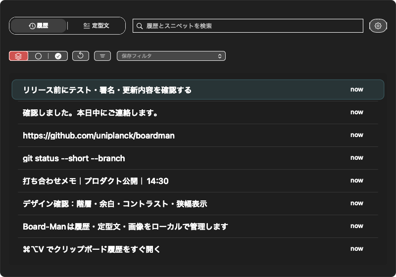
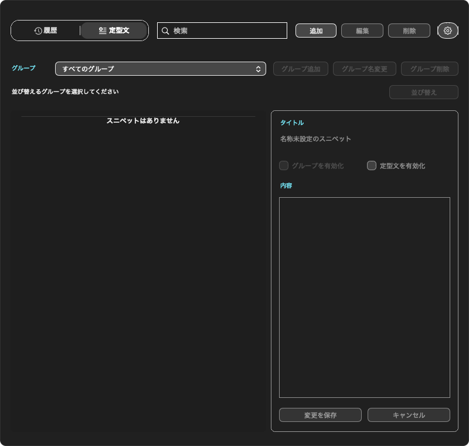
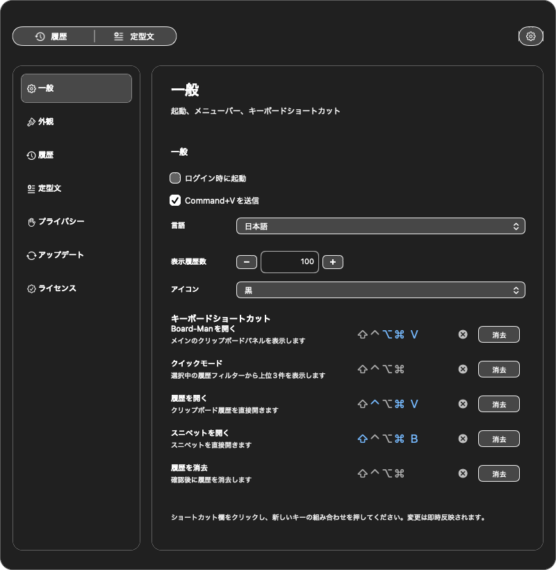
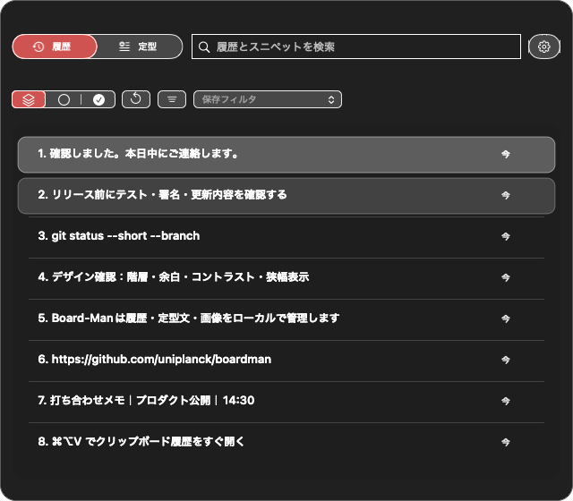

# Board-Man

[English](../../README.md) · **日本語** · [简体中文](README.zh-CN.md) · [한국어](README.ko.md) · [Español](README.es.md) · [Français](README.fr.md) · [Deutsch](README.de.md) · [Português](README.pt-BR.md)

Board-Manは、クリップボード履歴、定型文、Pin、検索、使用回数、画像プレビューを1つのキーボード操作中心のパネルへまとめた、ローカルファーストのmacOSアプリです。

> 現在の正式な製品ラインは **v0.1.0** です。旧v1.2.3実験版から意図的にバージョンをリセットした後の正式ラインで、`main`ブランチにはタグ付きリリースへ未収録の変更が含まれる場合があります。

## 画面と主な機能



- `⌘⌥V`でクリップボード履歴をすぐ開く
- テキスト、URL、コマンド、画像を検索して貼り付ける
- 重要な項目をPinまたは期限付きPinで残す
- 繰り返し使う文章を定型文として保存する
- 使用回数から頻繁に使う項目を把握する
- ローカルデータを削除せず、機密項目をパネル上でマスクする
- 時刻、ショートカット、外観、保持件数、パネル動作を調整する
- クラウド同期を必須にせず、履歴をMac内で扱う

### 定型文



返信文、コマンドの雛形、URL、リリース確認など、繰り返し貼り付ける文章をグループで整理できます。表示名と内容の編集、並び替え、有効・無効の切り替え、グループショートカットに対応しています。

上流由来のコード内部では`snippet`という名称を残していますが、製品UIでは日本語を**定型文**、英語を**Templates**としています。

### 設定と言語



一般設定、外観、履歴、定型文、プライバシー、更新、ライセンス、ショートカット、時刻表示、使用回数、パネルサイズを設定できます。製品UIは英語、日本語、簡体字中国語、韓国語に対応し、このリポジトリには追加のREADME翻訳もあります。

### コンパクト表示



横幅を狭めても、Pinと時刻の領域や左右の余白を優先して維持し、中央の本文だけを縮めます。タブ名は読めない省略表示にせず、言語ごとの短い表記へ切り替わります。

## ダウンロード

[Board-Man v0.1.0](https://github.com/uniplanck/boardman/releases/tag/v0.1.0)から`Board-Man-v0.1.0.zip`をダウンロードして展開し、`Board-Man.app`を`/Applications`へ移動してください。

初回起動をmacOSに止められた場合は、Control-clickして**開く**を選ぶか、**システム設定 → プライバシーとセキュリティ**から許可してください。

グローバルショートカットと安定した貼り付けには、アクセシビリティと入力監視の権限が必要です。権限はmacOSの画面から手動で許可する必要があり、Board-ManはTCC保護を迂回しません。

## 基本操作

1. テキスト、URL、コマンド、画像をコピーします。
2. `⌘⌥V`またはメニューバーからBoard-Manを開きます。
3. 検索または上下キーで項目を選びます。
4. Returnを押すと、元の入力欄へ選択項目を貼り付けます。
5. 残したい項目をPinし、繰り返す文章を定型文へ保存します。

| 操作 | ショートカット |
|---|---|
| Board-Manを開く | `⌘⌥V` |
| 履歴 / 定型文 / 設定 | `⌘1` / `⌘2` / `⌘3` |
| 検索へ移動 | `⌘F` |
| 選択移動 | `↑` / `↓` |
| 選択項目を貼り付け | `Return` |
| 選択項目をコピー | `⌘C` |
| Pin切り替え | `⌘P` |
| プレビュー | `Space` |

## 必要環境

- macOS 13以降
- Apple SiliconまたはIntel Mac
- 全ショートカットと貼り付け機能にはアクセシビリティと入力監視の権限が必要

## ビルド

```bash
git clone https://github.com/uniplanck/boardman.git
cd boardman
xcodebuild \
  -project Board-Man.xcodeproj \
  -scheme Board-Man \
  -configuration Debug \
  -destination 'platform=macOS' \
  -skipPackagePluginValidation \
  -skipMacroValidation \
  build
```

テスト:

```bash
xcodebuild \
  -project Board-Man.xcodeproj \
  -scheme Board-Man \
  -configuration Debug \
  -destination 'platform=macOS' \
  -parallel-testing-enabled NO \
  -maximum-parallel-testing-workers 1 \
  test
```

ローカル開発版の安定したインストールには[`scripts/boardman/install-dev-stable.sh`](../../scripts/boardman/install-dev-stable.sh)を使い、[`docs/boardman-dev-install.md`](../boardman-dev-install.md)を確認してください。

## README画像の再生成

現在のソースからDebug版をビルドした後、次を実行します。

```bash
BOARDMAN_SCREENSHOT_APP=/path/to/Board-Man.app \
  ./scripts/boardman/capture-readme-screenshots.sh
```

スクリプトは、隔離された一時プロファイルでBoard-Manを起動し、クリップボードを決め打ちの安全なデモ内容へ差し替え、英語と日本語の履歴、定型文、設定、コンパクト表示を自動生成して`docs/assets/screenshots/`へ保存します。終了時には一時プロファイルを削除し、クリップボードへ無害な完了メッセージを残します。通常利用中の履歴や定型文データベースは撮影に使いません。

詳しい手順と確認項目は[`docs/readme-screenshots.md`](../readme-screenshots.md)にあります。

## ドキュメント

- [変更履歴](../../CHANGELOG.md)
- [開発版インストール](../boardman-dev-install.md)
- [QAチェックリスト](../BOARDMAN_QA_CHECKLIST.md)
- [README画像生成](../readme-screenshots.md)
- [リリース・更新設計](../boardman-release-update-spec.md)
- [UIデザインシステム](../boardman-ui-design-system.md)
- [コントリビューションガイド](../../.github/CONTRIBUTING.md)
- [セキュリティポリシー](../../.github/SECURITY.md)
- [サポートガイド](../../.github/SUPPORT.md)

## セキュリティ

クリップボード履歴には、パスワード、token、顧客情報、非公開URL、ローカルパスが含まれる可能性があります。プライバシー設定を確認し、必要に応じて機密項目をマスクし、実際の履歴、`.env`、認証情報、ローカル認証ファイルをcommitしないでください。

README画像は隔離したデモプロファイルだけから生成します。脆弱性の報告方法は[`.github/SECURITY.md`](../../.github/SECURITY.md)を確認してください。

## ライセンスと帰属

Board-Manは[Clipy](https://github.com/Clipy/Clipy)を大きく変更した派生著作物で、上流プロジェクトの帰属表示とライセンスを保持します。

- [`ATTRIBUTION.md`](../../ATTRIBUTION.md)
- [`LICENSE`](../../LICENSE)
- [`LICENSE_CLIPMENU`](../../LICENSE_CLIPMENU)

Board-Manは継承したMITライセンス条件で配布され、上流のClipyまたはClipMenuメンテナーによる承認を受けたものではありません。
