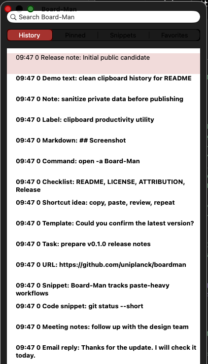

# Board-Man

[English](../../README.md) / [ja](README.ja.md) / [zh-CN](README.zh-CN.md) / [es](README.es.md) / [pt-BR](README.pt-BR.md) / [ko](README.ko.md) / [de](README.de.md) / [fr](README.fr.md)

Board-Man é uma ferramenta open-source de produtividade para a área de transferência no macOS, derivada do Clipy.

Ela não serve apenas para salvar o histórico da área de transferência. A ideia é tornar mais visível o trabalho baseado em copiar, colar, editar e mover texto entre aplicativos.

## O que ele faz

Board-Man foi criado para fluxos de trabalho em que copiar e colar acontece muitas vezes ao longo do dia.

Principais direções:

- consultar o histórico da área de transferência
- tornar a atividade de colagem mais visível
- melhorar fluxos de trabalho centrados em copiar e colar
- mostrar status na barra de menus
- funcionar como uma utilidade local para macOS

## Para quem é

- escritores
- desenvolvedores
- operadores de vídeo, redes sociais e marketing
- usuários que lidam com textos prontos e URLs com frequência
- usuários de Mac com muito trabalho de copiar e colar
- pessoas interessadas em automação local e visualização do trabalho

## Instalação

No momento, este projeto é um candidato público inicial. As versões disponíveis podem ser vistas aqui:

- [Board-Man v0.1.1](https://github.com/uniplanck/boardman/releases/tag/v0.1.1)

## Licença e atribuição

Board-Man é uma versão modificada derivada do Clipy.

Os avisos da licença MIT e de copyright do projeto original são preservados em:

- `LICENSE`
- `LICENSE_CLIPMENU`
- `ATTRIBUTION.md`

Board-Man não é um projeto oficial nem uma versão aprovada pelo Clipy / ClipMenu.

## Links

- GitHub: https://github.com/uniplanck/boardman
- Website: https://uniplanck.com
