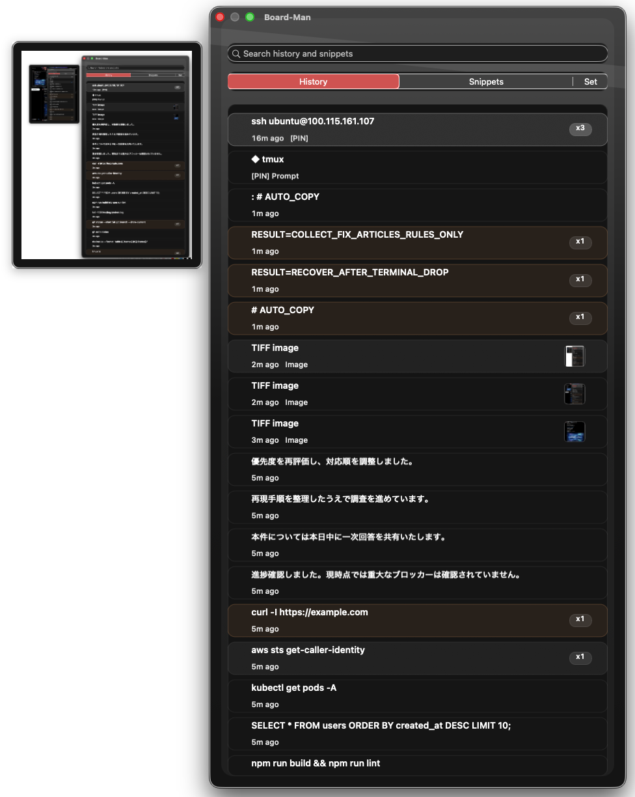

# Board-Man

[English](../../README.md) / [ja](README.ja.md) / [zh-CN](README.zh-CN.md) / [es](README.es.md) / [pt-BR](README.pt-BR.md) / [ko](README.ko.md) / [de](README.de.md) / [fr](README.fr.md)

Board-Man 是一款源自 Clipy 的 macOS 剪贴板效率工具。

它让你可以从菜单栏随时访问剪贴板历史，并为经常在不同应用之间复制、粘贴、编辑和移动文本、URL、命令及图片的人提供更清晰的工作流可见性。

> 状态：公开候选版。本仓库是从仍在积极开发的私有构建整理而来的开源版本。

## 截图

## Board-Man 能做什么

- 从菜单栏访问最近的剪贴板历史。
- 保存并粘贴可复用的片段。
- 为常用项目显示粘贴次数徽章。
- 处理图片剪贴板条目，包括类似截图的纯图片剪贴板内容。
- 搜索剪贴板历史。
- 使用键盘在面板中导航。
- 固定重要项目。
- 调整快捷键、历史数量限制、菜单行为和视觉主题选项。
- 在 macOS 本地运行，不会把剪贴板内容发送到外部服务。

## 下载

- [下载 Board-Man v1.2.3](https://github.com/uniplanck/boardman/releases/tag/v1.2.3)
- macOS 应用归档：`Board-Man-v1.2.3.zip`

## 安装和首次启动

1. 从发布页面下载 `Board-Man-v1.2.3.zip`。
2. 解压归档文件。
3. 将 `Board-Man.app` 移动到 `/Applications`。
4. 打开 Board-Man。

如果 macOS Gatekeeper 阻止首次启动，请打开 **System Settings > Privacy & Security** 并允许 Board-Man，或 Control-click 应用并选择 **Open**。

## 基本用法

1. 像平常一样复制文本、URL、命令或图片。
2. 从菜单栏打开 Board-Man。
3. 搜索或浏览剪贴板历史。
4. 选择一个项目，将其粘贴到当前活动的应用中。
5. 对经常粘贴的文本使用片段。

## 剪贴板历史

Board-Man 会保存最近的剪贴板项目，让你无需重新复制，就能回到文本、URL、命令和图片剪贴板条目。

适合在以下场景使用：

- 复用之前复制过的内容
- 避免只为再次复制同一段文本而在文档之间切换
- 将最近的命令或 URL 放在手边
- 回顾复制/粘贴密集型工作的流程

## 片段

片段是可复用的文本条目，适用于常粘贴的短语、模板、URL、命令和其他内容。

常见用途：

- 重复回复
- 命令模板
- 营销或社交媒体文本块
- 支持消息
- URL 和简短样板文本

## 粘贴次数徽章

粘贴次数徽章会显示某个项目已被粘贴的次数。

这有助于你发现：

- 经常复用的文本
- 反复运行的命令
- 工作流中核心的素材或片段
- 可能值得转成片段或自动化的复制/粘贴模式

## 图片剪贴板支持

Board-Man 支持图片剪贴板条目，并可以在历史列表中显示纯图片剪贴板内容。

复制以下内容时很有用：

- 截图
- 图形
- 设计参考
- 应用之间的视觉剪贴板内容

图片条目使用基于时间戳的标识，因此 `TIFF image` 或 `PNG image` 这类通用名称不会在粘贴次数中相互冲突。

## 搜索和键盘导航

使用搜索可以筛选剪贴板历史。面板按键盘驱动的方式设计，因此你可以在不离开当前工作流的情况下搜索、浏览结果并粘贴。

## 设置和外观

Board-Man 提供菜单行为、快捷键、历史数量限制和视觉外观设置。根据当前构建，你可以使用主题和较浅的显示选项，让面板更易阅读。

## 隐私

Board-Man 是本地 macOS 工具。剪贴板内容由应用在本地处理。除非你了解相关风险，否则不要在剪贴板历史中保存密钥、令牌、密码或客户隐私数据。

## 许可和署名

Board-Man 是基于 Clipy 深度修改的衍生作品。

本仓库保留了上游署名和许可证声明：

- `ATTRIBUTION.md`
- `LICENSE`
- `LICENSE_CLIPMENU`

Board-Man 按照从 Clipy 继承的 MIT 许可条款分发。它未获得上游 Clipy 或 ClipMenu 维护者的认可。
